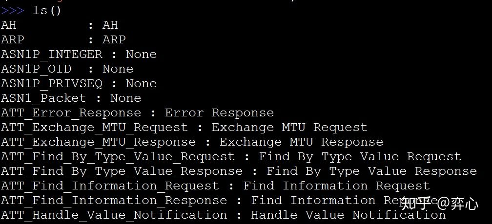
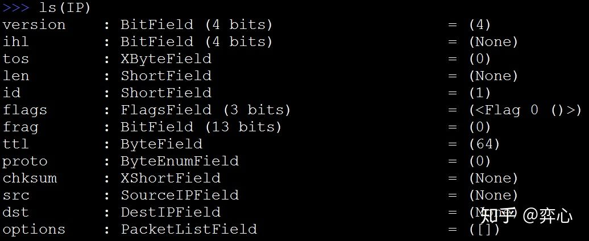
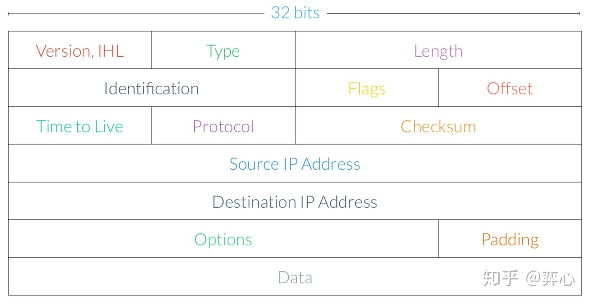
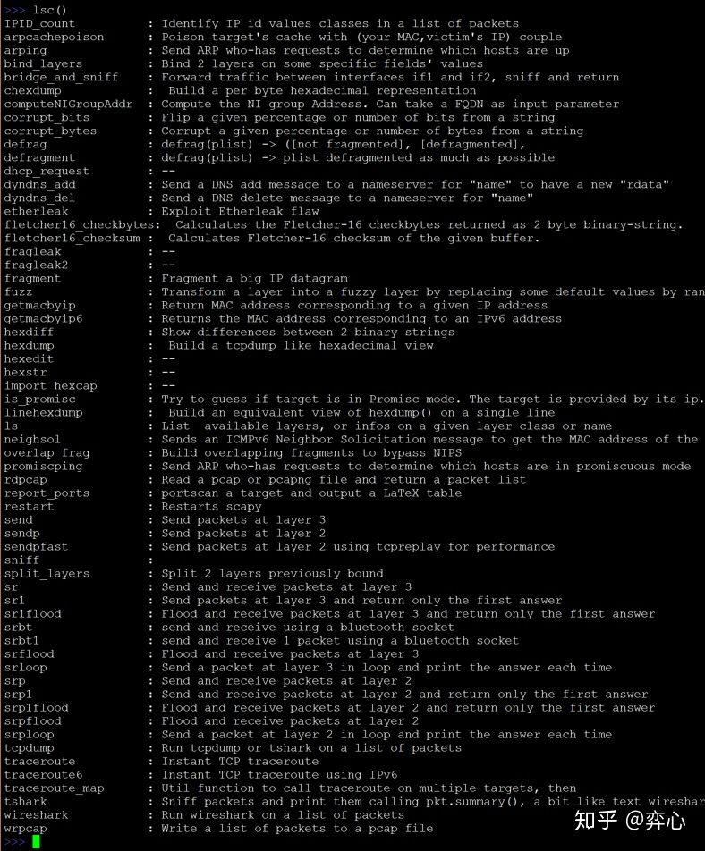
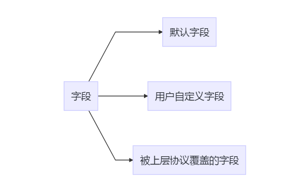
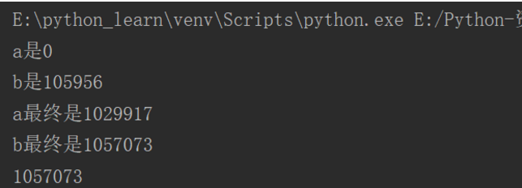
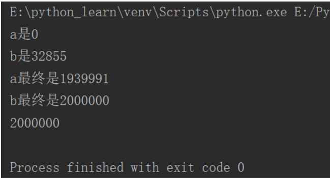

# 参考

# 内存管理

# 函数


# 错误和异常


# 模块

## pip工具

### 介绍
官方详细介绍地址：https://pip.pypa.io/en/stable/
### 安装包
#### 安装源


- Python官方：https://pypi.python.org/simple
- 豆瓣：http://pypi.douban.com/simple/
- 阿里：http://mirrors.aliyun.com/pypi/simple/
- 中国科学技术大学：https://pypi.mirrors.ustc.edu.cn/simple/

说明：默认使用的安装源为Python官方，由于Python官方服务器在国外，所以国内访问有可能非常慢，网络不好。豆瓣，阿里，中国科学技术大学为Python官方的镜像地址，服务器在国内，所以网络比较通畅，速度快！
#### 切换安装源
##### 一次性修改

指定检索：仅仅只到某一个地址检索指定包

```
pip install --index-url https://pypi.douban.com/simple/ requests
```


扩展检索：除下到官方的pypi地址检索，也会到扩展的地址检索

```
pip install --extra-index-url https://pypi.douban.com/simple/ requests
```

  


##### 永久性修改
在c://users/你的用户名/下，创建pip文件夹，在pip文件夹中创建pip.ini文件，文件内容为：

```
[global]
	index-url = http://pypi.douban.com/simple/
[install]
	trusted-host=pypi.douban.com
```


#### 安装在不同的Python版本环境中
##### 方式1

```
python -m pip install requests
python3 -m pip install requests
```

##### 	方式2

```
py -2 -m pip install requests
py -3 -m pip install requests
```

##### 	理论

Python的安装包实际上在系统中安装了一个启动器py.exe，位置为C:\Windows\py.exe
启动器可以调用不同版本的Python去执行某些脚本
- py -2调用的是python
- py -3调用的是python3

### 查看包


所有已经安装的

```
pip list
```

不被依赖的包

```
pip list --not-required
```

过期的包

```
pip list --outdated
```

查看某个包的具体信息

```
pip show xxx
```


### 搜索包

```
pip search xxx
pip search -i 检索地址 xxx
	默认为Python官方的库地址：https://pypi.python.org/simple
    例如：
		pip search peppercorn
```

### 安装特定版本

```
pip install "requests == 2.18"
pip install "requests >= 2.0"
pip install "requests > 2.0, < 3.0"
```

### 升级包

```
pip install --upgrade xxx
```
注意：“pip install xxx“表示：只有当xxx库不存在的时候，才会安装最新版本

### 卸载包

```
pip uninstall xxx
```
说明：
- 如果是通过easy_install安装的， 会自动删除easy_install.pth文件中对应包路径，会自动删除对应.egg包的原文件
- 如果是通过pip install安装的，会直接删除对应包文件

### 生成冻结需求文本
场景<br>
可以将当前安装的三方包记录，存储到指定的文件当中以后，就可以根据这个需求文本，去安装三方包
用法<br>
	
```
pip freeze > requirements.txt
```

用来将当前环境下安装的三方包输出到指定文件中因为输出的文件，以后是为了让别人通过pip安装.所以，能看到的列表中自动过滤了pip, setuptools,可通过 --all参数查看所有包
### 根据冻结需求文本安装

```
pip install -r requirements.txt
```

# 面向对象

# 常用库


## scapy库

### 参考

- [scapy官方文档](https://scapy.readthedocs.io/en/latest/index.html)
- [Python scapy.all Module](https://www.programcreek.com/python/index/6869/scapy.all)
- [scapy中文教程](https://github.com/Larryxi/Scapy_zh-cn)
- https://zhuanlan.zhihu.com/p/51002301
- https://zhuanlan.zhihu.com/p/66971101
- https://zhuanlan.zhihu.com/p/53264096
- https://zhuanlan.zhihu.com/p/34932386
- https://www.meiwen.com.cn/subject/zffobttx.html
- https://blog.csdn.net/austin1000/article/details/100042405

### 简介

Scapy是一个Python程序，使用户能够发送，嗅探和剖析并伪造网络数据包。此功能允许构建可以探测，扫描或攻击网络的工具。
换句话说，Scapy是一个功能强大的交互式数据包操作程序。它能够伪造或解码大量协议的数据包，通过线路发送，捕获它们，匹配请求和回复等等。Scapy可以轻松处理大多数经典任务，如扫描，跟踪路由，探测，单元测试，攻击或网络发现。它可以取代hping，arpspoof，arp-sk，arping，p0f甚至是Nmap，tcpdump和tshark的某些部分。

Scapy主要做两件事：发送数据包和接收答案。您定义一组数据包，它发送它们，接收答案，匹配带答案的请求，并返回数据包对（请求，应答）列表和不匹配数据包列表。这比Nmap或hping这样的工具具有很大的优势，即答案不会减少到（打开/关闭/过滤），而是整个数据包。
除此之外，还可以构建更高级别的功能，例如，执行traceroutes并且仅提供请求的起始TTL和答案的源IP的功能。一个ping整个网络并给出机器回答的列表。执行portscan并返回LaTeX报告的人。

主要是功能：

1. 构造数据包。
2. 发送数据包。
3. 捕获数据包，生成pcap。
4. 解析pcap文件。

#### 安装

```
pip install scapy
pip install ipython
```

#### 使用注意

在Windows上，请打开命令提示符（cmd.exe）并确保您具有管理员权限：

```
C:\>scapy
Welcome to Scapy (2.4.2)

#如果您没有安装所有可选包，Scapy会通知您某些功能将不可用，但是，发送和接收数据包的基本功能仍应有效。
INFO: Can't import python matplotlib wrapper. Won't be able to plot.
INFO: Can't import PyX. Won't be able to use psdump() or pdfdump().
```

### 用法

#### 基本命令

- `ls()`：显示支持所有协议， `ls()`也可以携带参数， 比如`ls(IP)`来查看IP包的各种默认参数                                           
- `lsc()`：查看scapy的指令集（函数）。比较常用的函数包括`arpcachepoison`（用于arp毒化攻击，也叫arp欺骗攻击），`arping`（用于构造一个ARP的who-has包） ，`send`(用于发3层报文)，`sendp`（用于发2层报文）, `sniff`（用于网络嗅探，类似`Wireshark`和`tcpdump`）, `sr`（发送+接收3层报文），`srp`（发送+接收2层报文）等等                                                             
- `help(协议、命令)`：显示更详细帮助。注意协议、命令不加单引号或者双引号
- `conf`：Show/set scapy configuration parameters

示例：





对应于IP报文的格式图：






#### 构造数据包

The / operator has been used as a composition operator between two layers. When doing so, the lower layer can have one or more of its defaults fields overloaded according to the upper layer. (You still can give the value you want). A string can be used as a raw layer.

```
# Setting protocol fields
>>> ip=IP(src="10.0.0.1")
>>> ip.dst="10.0.0.2"
# Combining layers
>>> l3=IP()/TCP()
>>> l2=Ether()/l3
# Splitting layers apart
>>> l2.getlayer(1)
<IP frag=0 proto=tcp |<TCP |>>
>>> l2.getlayer(2)
<TCP |>
```



##### 指定IP值 Explicit IP address (use quotation marks)

```
>>> IP(dst="192.0.2.1")
```

##### 指定域名 DNS name to be resolved at time of transmission

```
>>> IP(dst="example.com")
```

```
# IP network (results in a packet template)
>>> IP(dst="192.0.2.0/24")
```

##### 随机生成ip和mac Random addresses with RandIP() and RandMAC()

```
>>> IP(dst=RandIP())
>>> Ether(dst=RandMAC())
```

##### 指定TTL范围 Set a range of numbers to be used (template)

```
>>> IP(ttl=(1,30))
# Random numbers with RandInt() and RandLong()
>>> IP(id=RandInt())
```

##### 构造带有OPTION选项的TCP包

```
from scapy.all import *
TCP_SYNACK=TCP(sport=Ddport, dport=Ssport, flags="SA", seq=SeqNr, ack=AckNr, options=[('Experiment',0xf989,0xcafe,0x0102,0x0002),('NOP',0),('NOP',0)])
ANSWER=sr1(ip/TCP_SYNACK)
```

##### **生成一组数据包**


#### 查看数据包

##### show()：查看数据包属性

使用show命令，查看都有哪些属性，比如IP.show()

```
###[ IP ]###
  version   = 4
  ihl       = None
  tos       = 0x0
  len       = None
  id        = 1
  flags     =
  frag      = 0
  ttl       = 64
  proto     = ip
  chksum    = None
  src       = 192.168.0.113
  dst       = 127.0.0.1
  \options   \

>>>
```

Let’s build a packet and play with it:

```
>>> a=IP(ttl=10) #设置ttl属性
>>> a
< IP ttl=10 |>
>>> a.src
’127.0.0.1’
>>> a.dst="192.168.1.1"
>>> a
< IP ttl=10 dst=192.168.1.1 |>
>>> a.src
’192.168.8.14’
>>> del(a.ttl)#并不是删除ttl属性，而是把ttl属性恢复为默认值
>>> a
< IP dst=192.168.1.1 |>
>>> a.ttl
64
```


#### 发送包（Sending Packets）

##### 发送三层包

发送一个包或者多个包在三层：

```
send(pkt, inter=0, loop=0, count=1, iface=N)
```

##### 发送二层包 

```python
sendp(pkt, inter=0, loop=0, count=1, iface=N) #发送一个或者多个包在二层
sendpfast(pkt, pps=N, mbps=N, loop=0, iface=N) #在二层快速发送多个包
```

举例

```
>>> sendp(Ether()/IP(dst="192.0.2.1")/UDP(dport=53))
.
Sent 1 packets.
```

##### 发送和接受包（Sending and Receiving Packets）

- sr(pkt, filter=N, iface=N), srp(…) 
  Send packets and receive replies 
- sr1(pkt, inter=0, loop=0, count=1, iface=N), srp1(…) 
  Send packets and return only the first reply 
- srloop(pkt, timeout=N, count=N), srploop(…) 
  Send packets in a loop and print each reply

```
>>> srloop(IP(dst="packetlife.net")/ICMP(), count=3)
RECV 1: IP / ICMP 174.143.213.184 > 192.168.1.140
RECV 1: IP / ICMP 174.143.213.184 > 192.168.1.140
RECV 1: IP / ICMP 174.143.213.184 > 192.168.1.140
```

##### 发送二层包和三层包的区别

`send()`函数将会在第3层发送数据包。也就是说它会为你处理路由和第2层的数据。`sendp()`函数将会工作在第2层。选择合适的接口和正确的链路层协议都取决于你。

注意：发送三层包的时候， Scapy查的是==自己路由表==（可以使用`conf.route`查看scapy的路由表），而==不是内核的路由表==。所以scapy会将你的数据包以不同于操作系统的方式路由，也就是说查的路由不是`ip route show`里的路由， 而是`conf.route`的路由。有关路由的操作如下：

- `conf.route`：显示`scapy`里的路由

- `conf.route.resync()`:如果网络发生了变化,scapy的路由表==不会主动刷新==，需要使用此函数手动刷新scapy自己的路由表与内核路由表保持一致。说明，刷新的方向是，内核路由表到scapy路由表，而不能逆过来

- `conf.route.delt()`：删除路由，并不会改变内核的路由，即使使用`conf.route.resync()`

- `conf.route.add()`：添加路由，并不会改变内核的路由,即使使用`conf.route.resync()`

  举例：

  ```python
  >>> conf.route
  Network      Netmask        Gateway      Iface   Output IP     Metric
  0.0.0.0      0.0.0.0        10.10.2.1    ens256  10.10.2.77    0
  0.0.0.0      0.0.0.0        10.10.1.1    ens224  10.10.1.77    0
  0.0.0.0      0.0.0.0        192.168.4.1  ens192  192.168.4.22  0
  0.0.0.0      0.0.0.0        192.168.3.1  ens160  192.168.3.22  0
  10.10.1.0    255.255.255.0  0.0.0.0      ens224  10.10.1.77    0
  10.10.2.0    255.255.255.0  0.0.0.0      ens256  10.10.2.77    0
  127.0.0.0    255.0.0.0      0.0.0.0      lo      127.0.0.1     1
  192.168.3.0  255.255.255.0  0.0.0.0      ens160  192.168.3.22  0
  192.168.4.0  255.255.255.0  0.0.0.0      ens192  192.168.4.22  0
  >>> conf.route.resync() #手动刷新，才能保证scapy的路由表和内核路由表一致
  >>> conf.route
  Network      Netmask        Gateway      Iface   Output IP     Metric
  0.0.0.0      0.0.0.0        192.168.3.1  ens160  192.168.3.22  0
  10.10.1.0    255.255.255.0  0.0.0.0      ens224  10.10.1.77    0
  10.10.2.0    255.255.255.0  0.0.0.0      ens256  10.10.2.77    0
  127.0.0.0    255.0.0.0      0.0.0.0      lo      127.0.0.1     1
  192.168.3.0  255.255.255.0  0.0.0.0      ens160  192.168.3.22  0
  192.168.4.0  255.255.255.0  0.0.0.0      ens192  192.168.4.22  0
  
  
  
  
  >>> conf.route.add(net="2.2.2.0/24", gw="192.168.3.1")
  >>> conf.route.add(net="2.2.3.0/24", gw="192.168.3.1") 
  >>> conf.route
  Network      Netmask        Gateway      Iface   Output IP     Metric
  0.0.0.0      0.0.0.0        192.168.3.1  ens160  192.168.3.22  0
  10.10.1.0    255.255.255.0  0.0.0.0      ens224  10.10.1.77    0
  10.10.2.0    255.255.255.0  0.0.0.0      ens256  10.10.2.77    0
  127.0.0.0    255.0.0.0      0.0.0.0      lo      127.0.0.1     1
  192.168.3.0  255.255.255.0  0.0.0.0      ens160  192.168.3.22  0
  192.168.4.0  255.255.255.0  0.0.0.0      ens192  192.168.4.22  0
  2.2.2.0      255.255.255.0  192.168.3.1  ens160  192.168.3.22  1
  2.2.3.0      255.255.255.0  192.168.3.1  ens160  192.168.3.22  1
  >>> conf.route.resync()
  >>> conf.route #从显示结果上看，并没有改变内核的路由表
  Network      Netmask        Gateway      Iface   Output IP     Metric
  0.0.0.0      0.0.0.0        192.168.3.1  ens160  192.168.3.22  0
  10.10.1.0    255.255.255.0  0.0.0.0      ens224  10.10.1.77    0
  10.10.2.0    255.255.255.0  0.0.0.0      ens256  10.10.2.77    0
  127.0.0.0    255.0.0.0      0.0.0.0      lo      127.0.0.1     1
  192.168.3.0  255.255.255.0  0.0.0.0      ens160  192.168.3.22  0
  192.168.4.0  255.255.255.0  0.0.0.0      ens192  192.168.4.22  0
  
  
  
  >>> conf.route.add(net="2.2.3.0/24", gw="192.168.3.1")
  >>> conf.route
  Network      Netmask        Gateway      Iface   Output IP     Metric
  0.0.0.0      0.0.0.0        192.168.3.1  ens160  192.168.3.22  0
  10.10.1.0    255.255.255.0  0.0.0.0      ens224  10.10.1.77    0
  10.10.2.0    255.255.255.0  0.0.0.0      ens256  10.10.2.77    0
  127.0.0.0    255.0.0.0      0.0.0.0      lo      127.0.0.1     1
  192.168.3.0  255.255.255.0  0.0.0.0      ens160  192.168.3.22  0
  192.168.4.0  255.255.255.0  0.0.0.0      ens192  192.168.4.22  0
  2.2.3.0      255.255.255.0  192.168.3.1  ens160  192.168.3.22  1
  >>> conf.route.delt(net="2.2.3.0/24", gw="192.168.3.1")   
  >>> conf.route
  Network      Netmask        Gateway      Iface   Output IP     Metric
  0.0.0.0      0.0.0.0        192.168.3.1  ens160  192.168.3.22  0
  10.10.1.0    255.255.255.0  0.0.0.0      ens224  10.10.1.77    0
  10.10.2.0    255.255.255.0  0.0.0.0      ens256  10.10.2.77    0
  127.0.0.0    255.0.0.0      0.0.0.0      lo      127.0.0.1     1
  192.168.3.0  255.255.255.0  0.0.0.0      ens160  192.168.3.22  0
  192.168.4.0  255.255.255.0  0.0.0.0      ens192  192.168.4.22  0
  
  ```

  

#### 嗅探包（Sniffing Packets）

```python
def sniff(count=0, store=1, offline=None, prn=None,filter=None,\
L2socket=None, timeout=None, opened_socket=None, stop_filter=None,\
iface=None，*args,**kargs)
```

参数如下：

- `count`：抓包的数量，0表示无限制；
- `store`：保存抓取的数据包或者丢弃，1保存，0丢弃
- `offline`：从 `pcap` 文件读取数据包，而不进行嗅探，默认为None
- `prn`：为每一个数据包定义一个函数，如果返回了什么，则显示。例如：`prn = lambda x: x.summary()`； （  `packct.summary()`函数返回的是对包的统计性信息 ）
- `filter`：过滤规则，使用`wireshark`里面的过滤语法
- `L2socket`：使用给定的 `L2socket`
- `timeout`：在给定的时间后停止嗅探，默认为 None
- `opened_socket`：对指定的对象使用 `.recv()` 进行读取；
- `stop_filter`：定义一个函数，决定在抓到指定数据包后停止抓包，如：`stop_filter = lambda x: x.haslayer(TCP)`；
- `iface`：指定抓包的接口

```
# Capture up to 100 packets (or stop with ctrl-c)
>>> pkts=sniff(count=100, iface="eth0")
>>> pkts
<Sniffed: TCP:92 UDP:7 ICMP:1 Other:0>
```

##### 嗅探一个数据包

```python
#coding=utf-8
from scapy.all import *
 
def packet_callbacke(packet):
    packet.show()
 
sniff(prn=packet_callbacke,count=1)
```

运行结果如下：

```txt
E:\python_learn\venv\Scripts\python.exe E:/python_learn/python_tool/parsepcap.py
###[ 802.3 ]### 
  dst       = 01:80:c2:00:00:00
  src       = 14:a5:1a:90:bd:0d
  len       = 38
###[ LLC ]### 
     dsap      = 0x42
     ssap      = 0x42
     ctrl      = 3
###[ Spanning Tree Protocol ]### 
        proto     = 0
        version   = 0
        bpdutype  = 0
        bpduflags = 0
        rootid    = 32768
        rootmac   = 14:a5:1a:90:bd:0d
        pathcost  = 0
        bridgeid  = 32768
        bridgemac = 14:a5:1a:90:bd:0d
        portid    = 32770
        age       = 0.0
        maxage    = 20.0
        hellotime = 2.0
        fwddelay  = 0.0
###[ Padding ]### 
           load      = '\x00\x00\x00\x00\x00\x00\x00\x00'
```

##### 设置过滤器

###### **实时捕获数据包**

```python
#coding=utf-8
from scapy.all import *
# 数据包回调函数
def packet_callback(packet):
    if packet[TCP].payload:
        mail_packet = str(packet[TCP].payload)
        if "user" in mail_packet.lower() or "pass" in mail_packet.lower():
            print "[*] Server: %s" % packet[IP].dst
            print "[*] %s" % packet[TCP].payload
# 开启嗅探器
sniff(filter="tcp port 80",prn=packet_callback,store=0)
```

###### 30秒抓一次并保存

```python
#coding=utf-8
from scapy.all import *
import os
# 数据包回调函数
def packet_callback(packet):
    if packet[TCP].payload:
        mail_packet = str(packet[TCP].payload)
        #print packet
        #print mail_packet.lower()
        if "user" in mail_packet.lower() or "pass" in mail_packet.lower():
            print "[*] Server: %s" % packet[IP].dst
            print "[*] %s" % packet[TCP].payload
 
# 开启嗅探器，过滤出tcp协议，一次抓30秒，
package=sniff(filter="tcp",timeout=30 ,prn=packet_callback,store=1)
 
#30s抓完后确定文件名，现在你目录下放一个test.pcap，不然会报错
#第二个包保存的文件名就是5000
 
j = 1
flowName = "test" + str(j) + ".pcap"
wrpcap(flowName,package)  #将抓取到的包保存为test.pcap文件
```


#### 解析数据包

##### 常用接口

```python
rdpcap()	#读取pcap文件
show()		#展示当前类型包含的属性及值
haslayer()	#判断当前流是否含有某层数据
getlayer()	#根据条件获取数据
```

##### 举例

```python
#coding=utf-8
from scapy.all import *
 
 
try:
    import scapy.all as scapy
except ImportError:
    import scapy
    
    
def parse_http_pcap(pcap_path):
    pcap_infos = list()
    packets = scapy.rdpcap(pcap_path)
    for p in packets:
        print "----"
        # 判断是否包含某一层，用haslayer
        if p.haslayer("IP"):
            src_ip = p["IP"].src
            dst_ip = p["IP"].dst
            print "sip: %s" % src_ip
            print "dip: %s" % dst_ip
        if p.haslayer("TCP"):
            #获取某一层的原始负载用.payload.original
            raw_http = p["TCP"].payload.original
            sport = p["TCP"].sport
            dport = p["TCP"].dport
            print "sport: %s" % sport
            print "dport: %s" % dport
            print "raw_http:\n%s" % raw_http
        
        if p.haslayer("HTTPRequest"):
            host = p["HTTPRequest"].Host
            uri = p["HTTPRequest"].Path
            # 直接获取提取好的字典形式的http数据用fields
            http_fields = p["HTTPRequest"].fields
            http_payload = p["HTTPRequest"].payload.fields
            print "host: %s" % host
            print "uri: %s" % uri
            print "http_fields:\n%s" % http_fields
            print "http_payload:\n%s" % http_payload
            
            
parse_http_pcap("test.pcap")
```


### 实例

注意，导入库的时候使用`from  scapy.all   import  *`

#### 例一： **嗅探登陆密码**

```python
def ftpsniff(pkt):
　　dest = pkt.getlayer(IP).dst
　　raw = pkt.sprintf('%Raw.load%')
　　user = re.findall('(?i)USER (.*)', raw)
　　pswd = re.findall('(?i)PASS (.*)', raw)
　　if user:
　　　　print '[*] Detected FTP Login to ' + str(dest)
　　　　print '[+] Username: ' + str(user[0])
　　elif pswd:
　　　　print '[+] Password: ' + str(pswd[0])
```


### 源码分析

#### 实例化一个TCP（）分析

dataofs----> data   offset的简写。

## 模板-jinja2

### 参考

[template](https://docs.python.org/3/library/string.html#template-strings)

[Using Python, YAML and Jinja2 to Generate Config Files](http://dontfragment.com/using-python-yaml-and-jinja2-to-generate-config-files/)

[jinja2语法](http://docs.jinkan.org/docs/jinja2/templates.html)

[简书-python-jinja2语法](https://www.jianshu.com/p/4739ad4dc5e1)

[jinja2语法小记](https://shansan.top/2019/01/09/Jinja2语法小记/)

[W3c jinja2中文文档](https://www.w3cschool.cn/yshfid/)

### 快速入门
快速入门的内容均参考自[Using Python, YAML and Jinja2 to Generate Config Files](http://dontfragment.com/using-python-yaml-and-jinja2-to-generate-config-files/)

#### 概述
使用python, yaml和jinja2生成配置文件， 需要三个组件：
1. Jinja2:用以定义模板
2. YAML-file：定义数据，这些数据是为了插入进配置文件中
3. Python脚本：把YAML-file中的数据插入进模板中，从而生成配置文件。

---

#### 安装工具：

- 安装jinja2库

```
pip install jinja2
```

- 安装yaml库
```
pip install pyyaml
```
#### 代码如下
目录结构：


##### 模板代码

test.template文件内容如下：
```
hostname: {{ name }}

interface: Loopback0
ip address: 10.0.0.{{ id }} 255.255.255.255


vlan: {{ vlan }}
name: {{ name }}


router: ospf 1
router-id: 10.0.0.{{ id }}
auto-cost: reference-bandwidth 10000

network: {{ networks.network }} area {{ networks.area }}

```

说明：

```
1. 被{{}}包住的是变量或者表达式
2. .........是循环结构
```

##### 数据代码
数据使用yaml格式，内容如下：

```yaml
id: 1
name: R1
vlans:
  10: Users
  20: Voice
  30: Management
ospf:
  - network: 10.0.1.0 0.0.0.255
    area: 0
  - network: 10.0.2.0 0.0.0.255
    area: 2
```

##### python脚本代码

```python
#Import necessary functions from Jinja2 module
from jinja2 import Environment, FileSystemLoader

#Import YAML module
import yaml

#Load data from YAML into Python dictionary
config_data = yaml.safe_load(open('./test.yaml'))

#Load Jinja2 template
env = Environment(loader = FileSystemLoader('../NXDDOS_template'), trim_blocks=True, lstrip_blocks=True)
template = env.get_template('test.template')

#Render the template with data and print the output
print(template.render(config_data))
```
##### 执行python脚本

```txt
/usr/bin/python2.7 /Users/hc0565/01tool/NXDDOS_template/test.py
hostname: R1

interface: Loopback0
ip address: 10.0.0.1 255.255.255.255

vlan: 10
name: Users
vlan: 20
name: Voice
vlan: 30
name: Management

router: ospf 1
router-id: 10.0.0.1
auto-cost: reference-bandwidth 10000
network: 10.0.1.0 0.0.0.255 area 0
network: 10.0.2.0 0.0.0.255 area 2

```
### 使用jinja2框架

```python
'''
1.首先提供一个模板文件
2.打开模板文件，并读取文件使用jinja2实例化一个对象
3.渲染
'''

filepath = "/test.template"
from jinja2 import Template

with open(filepath, "r") as fd:
    test_template = Template(fd.read())
    test_content = test_template.render()

```

### jinja2模板语法
详情见[jinja2语法](http://docs.jinkan.org/docs/jinja2/templates.html),此文档只列出常用的语法
#### 变量
#### 结构
#### 方法


## 多线程库

### 参考
- [多线程实例](https://github.com/arifulhaqueuc/python-multithreading-examples)
- [多线程爬虫](https://github.com/suliangxd/multithreading-spider)
- [多线程学习总结](https://blog.csdn.net/comprel/article/details/72798319)
- [python使用Ctrl+C中断threading多线程死循环及setDaemon守护进程](https://blog.csdn.net/comprel/article/details/72798331)
- [多线程threading](http://www.liujiangblog.com/course/python/79)

### 简介
在Python3中，通过threading模块提供线程的功能。原来的thread模块已废弃。但是threading模块中有个Thread类（大写的T，类名），是模块中最主要的线程类，一定要分清楚了，千万不要搞混了。
### 组成
#### 方法与属性
threading模块提供了一些比较实用的方法或者属性，例如：

```
方法与属性 	        描述
current_thread() 	返回当前线程
active_count() 	    返回当前活跃的线程数，1个主线程+n个子线程
get_ident() 	    返回当前线程
enumerater() 	    返回当前活动 Thread 对象列表
main_thread() 	    返回主 Thread 对象
settrace(func) 	    为所有线程设置一个 trace 函数
setprofile(func) 	为所有线程设置一个 profile 函数
stack_size([size]) 	返回新创建线程栈大小；或为后续创建的线程设定栈大小为 size
TIMEOUT_MAX 	    Lock.acquire(), RLock.acquire(), Condition.wait() 允许的最大超时时间
```
#### 类
threading模块包含下面的类：

- Thread：基本线程类
- Lock：互斥锁
- RLock：可重入锁，使单一进程再次获得已持有的锁(递归锁)
- Condition：条件锁，使得一个线程等待另一个线程满足特定条件，比如改变状态或某个值。
- Semaphore：信号锁。为线程间共享的有限资源提供一个”计数器”，如果没有可用资源则会被阻塞。
- Event：事件锁，任意数量的线程等待某个事件的发生，在该事件发生后所有线程被激活
- Timer：一种计时器
- Barrier：Python3.2新增的“阻碍”类，必须达到指定数量的线程后才可以继续执行。

### Thread类

#### 多线程
##### 介绍
###### 原型

```
threading.Thread(self, 
                group   =   None,
                target  =   None,
                name    =   None,
                args    =   (),
                kwargs  =   None,
                *,
                daemon  =   None)
```

- 参数group是预留的，用于将来扩展；
- 参数target是一个可调用对象，在线程启动后执行；
- 参数name是线程的名字。默认值为“Thread-N“，N是一个数字。
- 参数args和kwargs分别表示调用target时的参数列表和关键字参数。

###### 方法和属性
- ==start()== 	启动线程，等待CPU调度
- ==run()== 	线程被cpu调度后自动执行的方法
- ==getName()、setName()和name== 	用于获取和设置线程的名称。
- ==setDaemon()== 	设置为后台线程或前台线程（默认是False，前台线程）。如果是后台线程，主线程执行过程中，后台线程也在进行，主线程执行完毕后，后台线程不论成功与否，均停止。如果是前台线程，主线程执行过程中，前台线程也在进行，主线程执行完毕后，等待前台线程执行完成后，程序才停止。
- ==ident== 	获取线程的标识符。线程标识符是一个非零整数，只有在调用了start()方法之后该属性才有效，否则它只返回None。
- ==is_alive()== 	判断线程是否是激活的（alive）。从调用start()方法启动线程，到run()方法执行完毕或遇到未处理异常而中断这段时间内，线程是激活的。
- ==isDaemon()方法和daemon属性== 	是否为守护线程
- ==join([timeout])== 	调用该方法将会使主调线程堵塞，直到被调用线程运行结束或超时。参数timeout是一个数值类型，表示超时时间，如果未提供该参数，那么主调线程将一直堵塞到被调线程结束。

##### 创建多线程
有两种方式来创建线程：一种是在实例化threading.Thread对象的时候，将线程要执行的任务函数作为参数传入线程；另一种是继承Thread类，并重写它的run()方法；
###### 方法一、实例化

```
import threading
import time

def show(arg):
    time.sleep(1)
    print('thread '+str(arg)+" running....")

if __name__ == '__main__':
    for i in range(10):
        t = threading.Thread(target=show, args=(i,))
        t.start()
```


###### 方法二、继承、重写run()方法


```
import threading

class MyThread(threading.Thread):
    def __init__(self, thread_name):
        # 注意：一定要显式的调用父类的初始化函数。
        super(MyThread, self).__init__(name=thread_name)

    def run(self):
        print("%s正在运行中......" % self.name)

if __name__ == '__main__':    
    for i in range(10):
        MyThread("thread-" + str(i)).start()
```

##### 多线程退出

线程分为前台线程和后台线程两种类型，默认情况下，线程为前台线程，可以使用Thread类的setDaemon()把前台线程设置为后台线程。多线程退出时，受线程类型的影响，具体如下：
- 如果是前台线程，主线程执行过程中，前台线程也在进行，主线程执行完毕后，等待前台线程执行完成后，程序才停止。
- 如果是后台线程，主线程执行过程中，后台线程也在进行，主线程执行完毕后，后台线程不论成功与否，均停止。


###### 例一、前台线程退出
代码：
```
import time
import threading

def doWaiting():
    print('start waiting:', time.strftime('%H:%M:%S'))
    time.sleep(3)
    print('stop waiting', time.strftime('%H:%M:%S'))

t = threading.Thread(target=doWaiting)
t.start()
# 确保线程t已经启动
time.sleep(1)
print('start job')
print('end job')
```
执行结果：

```
start waiting: 10:50:35
start job
end job
stop waiting 10:50:38
```
Python默认会等待最后一个线程执行完毕后才退出。上面例子中，主线程没有等待子线程t执行完毕，而是啥都不管，继续往下执行它自己的代码，执行完毕后也没有结束整个程序，而是等待子线程t执行完毕，整个程序才结束。

###### 例二、后台进程退出
代码：
```
import threading
import time

def run():
    print(threading.current_thread().getName(), "开始工作")
    time.sleep(2)       # 子线程停2s
    print("子线程工作完毕")

for i in range(3):
    t = threading.Thread(target=run,)
    t.setDaemon(True)   # 把子线程设置为守护线程，必须在start()之前设置
    t.start()

time.sleep(1)     # 主线程停1秒
print("主线程结束了！")
print(threading.active_count())  # 输出活跃的线程数
```
执行结果：

```
Thread-1 开始工作
Thread-2 开始工作
Thread-3 开始工作
主线程结束了！
4
```
可以看出，子线程并没有执行到“子线程工作完毕”那一行就退出了。也就是说，当主线程结束后，守护子线程也会随之结束，整个程序也跟着退出。


### 多线程存在的问题——资源竞争
举例：

```
import threading
num = 0

def add_a(count):
    global num
    print('a是'+str(num))
    for i in range(count):
        num += 1
    print('a最终是'+str(num))

def add_b(count):
    global num
    print('b是'+str(num))
    for i in range(count):
        num += 1
    print('b最终是'+str(num))

def main():
    t1 = threading.Thread(target=add_a, args=(1000000,))
    t2 = threading.Thread(target=add_b, args=(1000000,))
    t1.start()
    t2.start()
    t1.join()
    t2.join()
    print(num)

if __name__ == '__main__':
    main()
```
执行结果：

分析：

我们给两个函数传递的参数是1000000,每个函数都是进行100w次的+1操作, 按照我们的常识来说, 最后的结果应该是200w才对, 但是结果却是1514861(这里的结果并不是固定的)
产生这种结果的原因是因为python的解释器会把一个简单的+1操作分成多步:

1. 获取num的值
2. 将num的值+1
3. 将运算完成的值赋给num

又因为这是多线程的, 所以cpu在处理两个线程的时候, 是采用雨露均沾的方式, 可能在线程一刚刚将num值+1还没来得及将新值赋给num时, 就开始处理线程二了, 因此当线程二执行完全部的num+=1的操作后, 可能又会开始对线程一的未完成的操作, 而此时的操作停留在了完成运算未赋值的那一步, 因此在完成对num的赋值后, 就会覆盖掉之前线程二对num的+1操作。

### 怎么解决资源竞争问题？
使用锁。具体为方法为：

在threading中有一个Lock类,通过调用Lock类中的acquire()方法, 可以将后面的代码保护起来一直执行, 其他的线程会处于监听状态,直到监听到那个线程调用了release()方法解锁, 才会继续争夺对cpu的使用权

```
import threading
num = 0
lock = threading.Lock()

def add_a(count):
    global num
    print('a是'+str(num))
    for i in range(count):
        lock.acquire()
        num += 1
        lock.release()
    print('a最终是'+str(num))

def add_b(count):
    global num
    print('b是'+str(num))
    for i in range(count):
        lock.acquire()
        num += 1
        lock.release()
    print('b最终是'+str(num))

def main():
    t1 = threading.Thread(target=add_a, args=(1000000,))
    t2 = threading.Thread(target=add_b, args=(1000000,))
    t1.start()
    t2.start()
    t1.join()
    t2.join()
    print(num)

if __name__ == '__main__':
    main()
```
执行结果如下：


### 实例
#### hello world

```
  
#!/usr/bin/python


# This is Hello World with Python multithreading.
# A user defined function is created and 
# the function is called when a thread is initialized. 


import threading


def MyFunction():
	"""This is a user defined function"""
	print "Hello World"
	return


def Main():
	"""This is where we create a thread. 
	Target means run this function when a thread is initiated."""
	myThread = threading.Thread(target=MyFunction) 	
	myThread.start() 	# Starting a thread


if __name__ == '__main__':
	Main()
```

#### 传参

```
#!/usr/bin/python


## This program adds two given numbers and prints the result.


import threading 


def MyFunction(num1, num2):
	"""This is user defined thread function"""
	print "Given numbers= %s, %s" %(num1, num2)
	print "Result = %d" %(int(num1)+int(num2))
	return


def Main():
	t = threading.Thread(
			target=MyFunction, 
			args=(12,13)
		)
	t.start()


if __name__ == '__main__':
	Main()
```
#### thread name

```
#!/usr/bin/python


# This multithreading program outputs default thread name 
# when the thread is being executed.


import threading
import time


def ThreadFunction():
	print threading.currentThread().getName(), "Starting"
	time.sleep(2)
	print threading.currentThread().getName(), "Exiting"


def Main():
	w = threading.Thread(target=ThreadFunction)
	w.start()


if __name__ == '__main__':
	Main()
```
#### threading.Timer

```
#!/usr/bin/python


## A Timer starts its work after a delay, 
## and can be canceled at any point within that delay time period.


import threading
import time
import logging


logging.basicConfig(
	level=logging.DEBUG,
    format='(%(threadName)-10s) %(message)s',
)


def delayed():
    logging.debug('Thread program still running')
    return

def Main():
	t1 = threading.Timer(3, delayed)
	t1.setName('Timer 1')
	t2 = threading.Timer(3, delayed)
	t2.setName('Timer 2')

	logging.debug('Starting thread timers')
	t1.start()
	t2.start()

	logging.debug('We are waiting before canceling %s', t2.getName())
	time.sleep(2)
	logging.debug('Now canceling %s', t2.getName())
	t2.cancel()


if __name__ == "__main__":
	Main()
```
